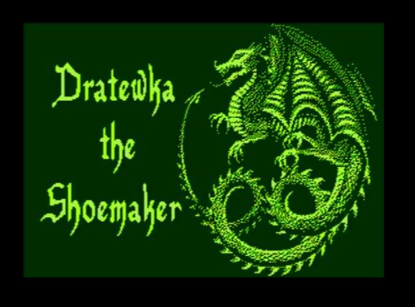
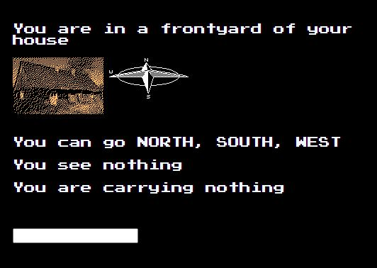
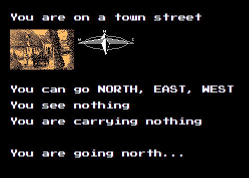

<h1>Dratewka_the_shoemaker</h1>

<h2>About game</h2>

This is the port of game on Atari 8bit family

Link to official game: https://www.mobygames.com/game/dratewka-the-shoemaker

In game you can move by typing

PS. To win this game you should find instruction

<h2>How to start game?</h2>
<ol>
  <li>Make sure that you have installed git command line</li>
  <li>Create empty folder</li>
  <li>Open new folder in cmd</li>
    <li>Write commands:
    <ol type="a" >
      <li><code>git init</code></li>
      <li><code>git pull https://github.com/szariii/Dratewka_the_shoemaker.git</code></li>
    </ol>
  </li>
  <li>Open index.html</li>
</ol>
<h2>Screenshots:</h2>

